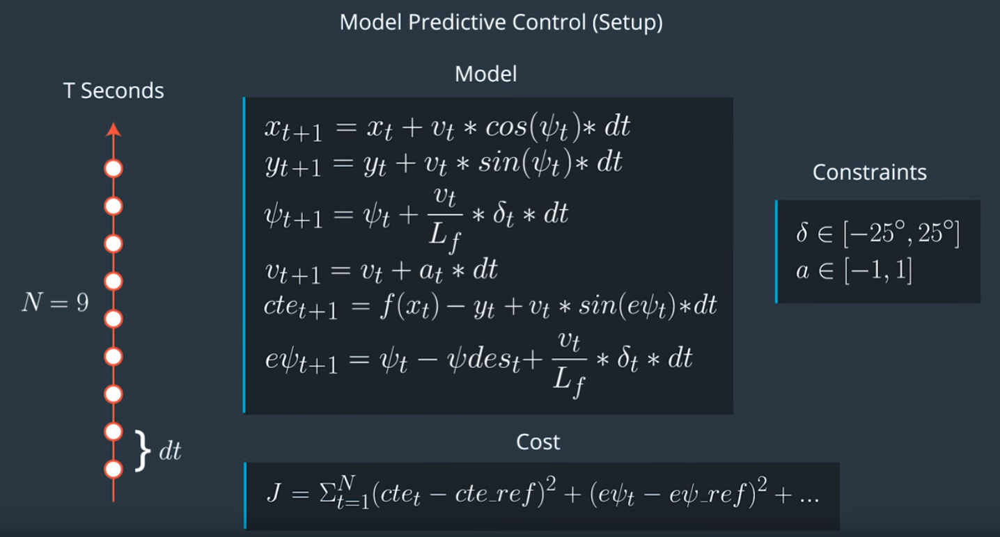
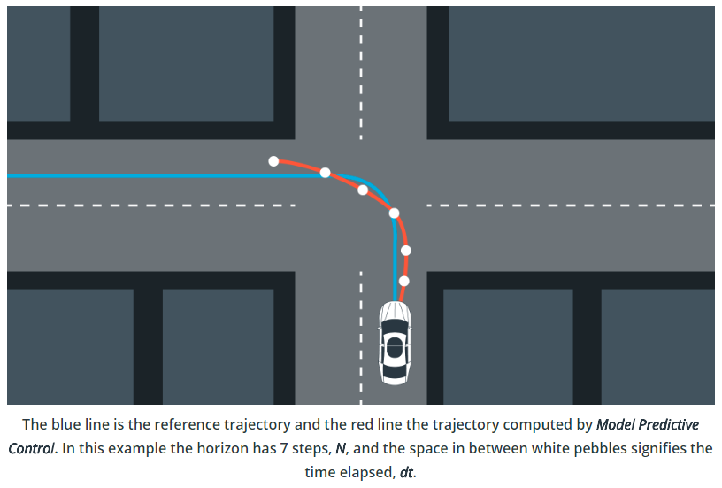

# Self-Driving Car Nanodegree - Model predictive control
Self-Driving Car Engineer Nanodegree Program

---

## Introduction

This repository contains my solution to the Udacity SDC- nano degree Model predictive control project. The goal of this project is to navigate a track in a Udacity-provided simulator, which communicates telemetry and track waypoint data via websocket, by sending steering and throttle commands back to the simulator. The solution must be robust to 100ms latency, as one may encounter in real-world application.


## Rubric Points

- **The Model**: *Student describes their model in detail. This includes the state, actuators and update equations.*

The kinematic model includes the vehicle's x and y coordinates, orientation angle (psi), and velocity(v), as well as the cross-track error(cte) and psi error (epsi). Actuator outputs are acceleration and steering angle. The model combines the state and actuations from the previous timestep to calculate the state for the current timestep based on the equations below:



- **Timestep Length and Elapsed Duration (N & dt)**: *Student discusses the reasoning behind the chosen N (timestep length) and dt (elapsed duration between timesteps) values. Additionally the student details the previous values tried.*


The values chosen for N and dt are 12 and 0.15, respectively. Starting point was 10 and 0,1 based on results from other students. While these results were not satisfactory, I've found N=12 and dt=1,5 after two iterations. These values mean that the optimizer is considering a 1.8 second duration in which to determine a corrective trajectory.

- **Polynomial Fitting and MPC Preprocessing**: *A polynomial is fitted to waypoints. If the student preprocesses waypoints, the vehicle state, and/or actuators prior to the MPC procedure it is described.*

The waypoints are preprocessed by transforming them to the vehicle's perspective (see main.cpp lines 108-114). This simplifies the process to fit a polynomial to the waypoints since the vehicle's x and y coordinates are now at the origin (0, 0) and the orientation angle is also zero. 



- **Model Predictive Control with Latency**: *The student implements Model Predictive Control that handles a 100 millisecond latency. Student provides details on how they deal with latency.*


The approach to dealing with latency was twofold (not counting simply limiting the speed): the original kinematic equations depend upon the actuations from the previous timestep, but with a delay of 100ms (which happens to be the timestep interval) the actuations are applied another timestep later, so the equations have been altered to account for this (MPC.cpp lines 104-107). Also, in addition to the cost functions suggested in the lessons (penalizing CTE, epsi, difference between velocity and a reference velocity, delta, acceleration, change in delta, and change in acceleration) an additional cost penalizing the combination of velocity and delta (MPC.cpp line 61) was included and results in much more controlled cornering.

## Results

The video shows the car driving around the lake track automously based on the MPC approach.

[](https://www.youtube.com/watch?v=aO9M5lk1CLc)


## Dependencies

* cmake >= 3.5
 * All OSes: [click here for installation instructions](https://cmake.org/install/)
* make >= 4.1(mac, linux), 3.81(Windows)
  * Linux: make is installed by default on most Linux distros
  * Mac: [install Xcode command line tools to get make](https://developer.apple.com/xcode/features/)
  * Windows: [Click here for installation instructions](http://gnuwin32.sourceforge.net/packages/make.htm)
* gcc/g++ >= 5.4
  * Linux: gcc / g++ is installed by default on most Linux distros
  * Mac: same deal as make - [install Xcode command line tools]((https://developer.apple.com/xcode/features/)
  * Windows: recommend using [MinGW](http://www.mingw.org/)
* [uWebSockets](https://github.com/uWebSockets/uWebSockets)
  * Run either `install-mac.sh` or `install-ubuntu.sh`.
  * If you install from source, checkout to commit `e94b6e1`, i.e.
    ```
    git clone https://github.com/uWebSockets/uWebSockets
    cd uWebSockets
    git checkout e94b6e1
    ```
    Some function signatures have changed in v0.14.x. See [this PR](https://github.com/udacity/CarND-MPC-Project/pull/3) for more details.

* **Ipopt and CppAD:** Please refer to [this document](https://github.com/udacity/CarND-MPC-Project/blob/master/install_Ipopt_CppAD.md) for installation instructions.
* [Eigen](http://eigen.tuxfamily.org/index.php?title=Main_Page). This is already part of the repo so you shouldn't have to worry about it.
* Simulator. You can download these from the [releases tab](https://github.com/udacity/self-driving-car-sim/releases).
* Not a dependency but read the [DATA.md](./DATA.md) for a description of the data sent back from the simulator.


## Basic Build Instructions

1. Clone this repo.
2. Make a build directory: `mkdir build && cd build`
3. Compile: `cmake .. && make`
4. Run it: `./mpc`.

## Tips

1. It's recommended to test the MPC on basic examples to see if your implementation behaves as desired. One possible example
is the vehicle starting offset of a straight line (reference). If the MPC implementation is correct, after some number of timesteps
(not too many) it should find and track the reference line.
2. The `lake_track_waypoints.csv` file has the waypoints of the lake track. You could use this to fit polynomials and points and see of how well your model tracks curve. NOTE: This file might be not completely in sync with the simulator so your solution should NOT depend on it.
3. For visualization this C++ [matplotlib wrapper](https://github.com/lava/matplotlib-cpp) could be helpful.)
4.  Tips for setting up your environment are available [here](https://classroom.udacity.com/nanodegrees/nd013/parts/40f38239-66b6-46ec-ae68-03afd8a601c8/modules/0949fca6-b379-42af-a919-ee50aa304e6a/lessons/f758c44c-5e40-4e01-93b5-1a82aa4e044f/concepts/23d376c7-0195-4276-bdf0-e02f1f3c665d)
5. **VM Latency:** Some students have reported differences in behavior using VM's ostensibly a result of latency.  Please let us know if issues arise as a result of a VM environment.


## Code Style

Please (do your best to) stick to [Google's C++ style guide](https://google.github.io/styleguide/cppguide.html).


